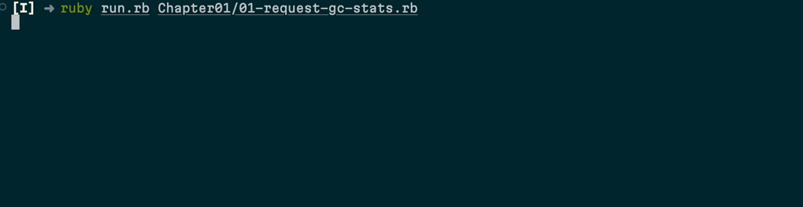

# Layered Design for Ruby on Rails Applications	
Layered Design for Ruby on Rails Applications, published by Packt

<a href="https://www.packtpub.com/product/layered-design-for-ruby-on-rails-applications/9781801813785"></a>

This is the code repository for [Layered Design for Ruby on Rails Applications](https://www.packtpub.com/product/layered-design-for-ruby-on-rails-applications/9781801813785), published by Packt.

**Discover practical design patterns for maintainable web applications.**

## What is this book about?
Ruby on Rails is an open-source framework for building web applications from scratch and develop a full-featured product. This book helps you keep the code maintainable while working on a Rails application by demonstrating the useful design patterns and exploring the common code abstractions.

This book covers the following exciting features:

* Discover Rails' core components and its request/response cycle
* Understand Rails' convention-over-configuration principle and its impact on development
* Explore patterns for flexibility, extensibility, and testability in Rails
* Identify and address Rails’ anti-patterns for cleaner code
* Implement design patterns for handling bloated models and messy views
* Expand from mailers to multi-channel notification deliveries
* Explore different authorization models and layers
* Use a class-based approach to configuration in Rails

If you feel this book is for you, get your [copy](https://www.amazon.com/Layered-Design-Ruby-Rails-Applications/dp/1801813787) today!

<a href="https://www.packtpub.com/?utm_source=github&utm_medium=banner&utm_campaign=GitHubBanner"></a>


## Instructions and navigations

All of the code is organized into folders. For example, Chapter02.

The `lib/` folder contains utilities to run code snippets. Most chapter folders also contain the `prelude.rb` file
with the environment configuration for the examples (dependecies, Rails application configuration, database schema extensions, etc).

You can run any example using the `ruby` command, for example:

```sh
$ ruby Chapter01/01-request-gc-stats.rb

Total allocations: 18573
```

### Using examples runner

You can also run examples using a specific runner scripts, which prints the source code along with intermediate
return values in addition to executing the code:

```sh
ruby run.rb Chapter01/01-request-gc-stats.rb
```

Here is an example output of the runner:



### Running Rails tasks

You can run Rails (Rake) tasks using the `bin/rails` executable:

```sh
$ bin/rails middleware

use ActionDispatch::HostAuthorization
use Rack::Sendfile
...
use Rack::TempfileReaper
run App.routes
```

You can also load the application modification for a particular chapter by specifying the `CHAPTER` env var:

```sh
$ CHAPTER=2 bin/rails routes

...
         books GET    /books(.:format)
    books#index
    categories GET    /categories(:format)
    categories#index
      category GET    /categories:id(.:format)
    categories#show
```

Finally, you can run a Rails server for a particular chapter (some chapters contain controllers and views examples). For example, for Chapter 7:

```sh
$ CHAPTER=7 bin/rails rails s

[2023-01-30 22:45:37] INFO  WEBrick 1.8.1
[2023-01-30 22:45:37] INFO  ruby 3.2.0 (2022-12-25) [aarch64-linux]
[2023-01-30 22:45:37] INFO  WEBrick::HTTPServer#start: pid=1266 port=3000
...
```

Now you can open a web server at [localhost:3000/users](http://localhost:3000/users) and play with the auto-generated Rails CRUD interface for users.

### Software and Hardware List

| Chapter  |        Software required             |           OS required               |
| -------- | ------------------------------------ | ----------------------------------- |
| 1-15     | Ruby 3.2                             |     Any OS that runs Ruby           |

### Related products <Other books you may enjoy>
* Web Development with Julia and Genie  [[Packt]](https://www.packtpub.com/product/web-development-with-julia-and-genie/9781801811132) [[Amazon]](https://www.amazon.in/Development-Julia-Genie-hands-high-performance/dp/180181113X)

* Practical Module development for Prestashop 8  [[Packt]](https://www.packtpub.com/product/practical-module-development-for-prestashop-8/9781837635962) [[Amazon]](https://www.amazon.in/Practical-Module-Development-Prestashop-customizable/dp/183763596X/ref=tmm_pap_swatch_0?_encoding=UTF8&qid=&sr=)

## Get to Know the Author
**Vladimir Dementyev** is a principal backend engineer at Evil Martians, a product development consultancy from Earth, focusing on building maintainable web applications and developers’ productivity. He is the creator of popular open source tools, such as AnyCable and TestProf, and a contributor to many other open source projects, including Ruby on Rails and Ruby itself. Vladimir plays an active role in the Ruby community through his code contributions and by speaking at conferences and sharing his passion for coding via articles and blog posts. For his contributions to the Ruby ecosystem, Vladimir was awarded the Fukuoka Ruby Award in 2021 and the Ruby Hero Russia Award in 2017.
